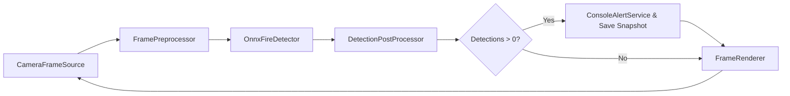

# FireDetectionApp

An Open source modular C# application for real‑time fire detection using ONNX and OpenCvSharp.

## Table of Contents

1. [Introduction](#introduction)
2. [Features](#features)
3. [Architecture](#architecture)
4. [Prerequisites](#prerequisites)
5. [Installation](#installation)
6. [Configuration](#configuration)
7. [Usage](#usage)
8. [Snapshot Directory](#snapshot-directory)
9. [Extending the Application](#extending-the-application)
10. [Troubleshooting](#troubleshooting)

---

## Introduction

`FireDetectionApp` is a highly modular, extensible C# console application that performs real‑time fire detection from a camera feed. It leverages a pre‑trained ONNX model (YOLOv5‑based) for fast local inference and uses OpenCvSharp for image capture, processing, and rendering. To reduce false positives (e.g., pictures of fire), it includes a simple temporal flicker filter and throttles alerts/snapshots to once every 5 seconds.

---

## Features

* **Live Camera Input** via `CameraFrameSource` (OpenCV VideoCapture)
* **Preprocessing**: resizing, color conversion (BGR→RGB), normalization into CHW tensor
* **On‑Device Inference**: ONNX Runtime (CPU & GPU support) with YOLOv5 fire detector
* **Post‑Processing**: confidence thresholding + non‑maximum suppression
* **Temporal Filtering**: skip static images (posters/screens) using frame‑difference flicker check
* **Alerting & Snapshot**: logs detection events and saves frame snapshots (max one every 5 seconds)
* **Modular Design**: easily swap or extend components (frame source, detector, alert service, renderer)

---

## Architecture



Each component implements a simple interface (`IFrameSource`, `IPreprocessor`, `IDetector`, `IPostProcessor`, `IRenderer`, `IAlertService`) for maximum flexibility and testability.

---

## Prerequisites

* **.NET SDK 7.0+**
* **macOS (Apple Silicon)** or Windows/Linux (adjust OpenCvSharp runtime package)
* A pre‑trained `fire_detection.onnx` model (place under `Models/`)
* **Dependencies** listed in `FireDetectionApp.csproj`

---

## Installation

1. **Clone the repository**

   ```bash
   git clone <your-repo-url>
   cd FireDetectionApp
   ```

2. **Create the .NET console project** (if starting fresh)

   ```bash
   dotnet new console -n FireDetectionApp
   cd FireDetectionApp
   ```

3. **Add NuGet packages**

   ```bash
   dotnet add package Microsoft.ML.OnnxRuntime
   dotnet add package OpenCvSharp4
   dotnet add package OpenCvSharp4.runtime.osx_arm64 --prerelease  # for M1/M2
   ```

4. **Project structure**

   ```text
   FireDetectionApp/
   ├── Models/
   │   └── fire_detection.onnx
   ├── Snapshots/          # auto‑created at runtime
   ├── Detection.cs
   ├── IFrameSource.cs
   ├── CameraFrameSource.cs
   ├── IPreprocessor.cs
   ├── FramePreprocessor.cs
   ├── IDetector.cs
   ├── OnnxFireDetector.cs
   ├── IPostProcessor.cs
   ├── DetectionPostProcessor.cs
   ├── FlickerFilter.cs
   ├── IRenderer.cs
   ├── FrameRenderer.cs
   ├── IAlertService.cs
   ├── ConsoleAlertService.cs
   └── Program.cs
   ```

---

## Configuration

Adjust the following constants in `Program.cs` or factor out into a config file:

* **Input resolution**: `IN_W`, `IN_H` (default 640×640)
* **Confidence threshold**: `CONF_THRESH` (default 0.5)
* **IoU threshold**: `IOU_THRESH` (default 0.45)
* **Flicker threshold**: passed to `FlickerFilter` (default 3.0)
* **Snapshot interval**: hard‑coded to 5 seconds in main loop

---

## Usage

Build and run:

```bash
dotnet clean
dotnet build
dotnet run
```

* The console window will display debug logs (`[Debug] Flicker check…`, `[Debug] Running ONNX inference…`, etc.)
* Real‑time video appears in an OpenCV window titled **Fire Detection**
* **Press** `ESC` to quit the application

---

## Snapshot Directory

When fire is detected (and snapshot interval elapsed), captures are saved as JPEGs in `Snapshots/`:

```
Snapshots/
└── fire_YYYYMMDD_HHMMSS.jpg
```

---

## Extending the Application

* **Alternate frame source**: implement `IFrameSource` for video files or RTSP streams.
* **Cloud‑based detector**: implement `IDetector` to call an API instead of ONNX.
* **Custom alerting**: create an `IAlertService` to send emails, SMS, or trigger GPIO.
* **Multi‑sensor fusion**: insert temperature or IR camera inputs before alerting.

---

## Troubleshooting

* **OpenCvSharpExtern errors**: ensure correct runtime package for your OS/architecture.
* **Model loading errors**: verify `Models/fire_detection.onnx` exists and matches your ONNX Runtime version.
* **False positives on static images**: tune the flicker threshold or add screen‑region masking.


---
