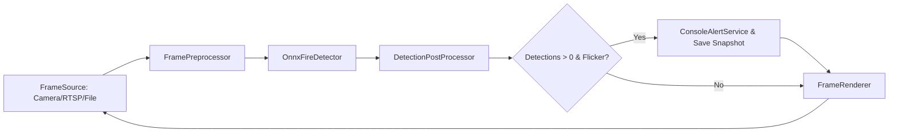

# FireDetectionApp

An open-source, modular C# console application for real-time fire detection using ONNX and OpenCvSharp.

## Table of Contents

1. [Introduction](#introduction)
2. [Features](#features)
3. [Architecture](#architecture)
4. [Prerequisites](#prerequisites)
5. [Installation](#installation)
6. [Configuration](#configuration)
7. [Usage](#usage)
8. [Snapshot Directory](#snapshot-directory)
9. [Extending the Application](#extending-the-application)
10. [Troubleshooting](#troubleshooting)

---

## Introduction

`FireDetectionApp` performs real-time fire detection on video streams. It uses a YOLOv5-based ONNX model for fast inference and OpenCvSharp for frame capture and rendering. To reduce false positives (e.g. photos of fire), it includes:

* A **temporal flicker filter** that skips static frames
* **Throttled** console alerts and image snapshots (once every N seconds)

---

## Features

* **Flexible Frame Sources**: USB webcams, CCTV RTSP streams, HTTP MJPEG, or local video files
* **Preprocessing**: resize + BGR→RGB + normalize to CHW tensor
* **Inference**: ONNX Runtime on CPU/GPU with YOLOv5 fire detector
* **Post-Processing**: confidence threshold + non-maximum suppression
* **Temporal Filtering**: skip static “fire” images via frame-difference flicker check
* **Alerts & Snapshots**: console log + JPEG saves (throttled)
* **Modular Design**: swap or extend any component (frame source, detector, alert service, renderer)

---

## Architecture



Each component implements a simple interface (`IFrameSource`, `IPreprocessor`, `IDetector`, `IPostProcessor`, `IRenderer`, `IAlertService`) for maximum flexibility and testability.

---

## Prerequisites

* [.NET 7.0+ SDK](https://dotnet.microsoft.com/download)
* **macOS (Apple Silicon)** or Windows/Linux (adjust OpenCvSharp runtime)
* A pre-trained `fire_detection.onnx` model in `Models/`
* See `FireDetectionApp.csproj` for NuGet dependencies

---

## Installation

```bash
git clone <your-repo-url>
cd FireDetectionApp

# (If not already a .NET project)
dotnet new console -n FireDetectionApp
cd FireDetectionApp

# Add required packages
dotnet add package Microsoft.Extensions.Configuration
dotnet add package Microsoft.Extensions.Configuration.Json
dotnet add package Microsoft.Extensions.Configuration.Binder
dotnet add package Microsoft.ML.OnnxRuntime
dotnet add package OpenCvSharp4
dotnet add package OpenCvSharp4.runtime.osx_arm64 --prerelease  # for M1/M2
```

Project structure:

```
FireDetectionApp/
├── Models/
│   └── fire_detection.onnx
├── Snapshots/             # created at runtime
├── AppSettings.cs
├── Detection.cs
├── IFrameSource.cs
├── CameraFrameSource.cs
├── IPreprocessor.cs
├── FramePreprocessor.cs
├── IDetector.cs
├── OnnxFireDetector.cs
├── IPostProcessor.cs
├── DetectionPostProcessor.cs
├── FlickerFilter.cs
├── IRenderer.cs
├── FrameRenderer.cs
├── IAlertService.cs
├── ConsoleAlertService.cs
└── Program.cs
```

---

## Configuration

All runtime parameters live in **appsettings.json**:

```jsonc
{
  "ModelPath":                  "Models/fire_detection.onnx",
  "Input": {
    "Width":  640,
    "Height": 640
  },
  "Thresholds": {
    "Confidence": 0.5,
    "IoU":        0.45,
    "Flicker":    3.0
  },
  "ThrottleIntervalSeconds":    5,
  "SnapshotDirectory":          "Snapshots",
  "FrameSource": {
    // Change this to select your input:
    // "0"                            → first USB/Webcam
    // "1"                            → second USB/Webcam
    // "rtsp://user:pass@ip:port/..." → RTSP CCTV stream
    // "http://ip:port/video"         → HTTP MJPEG stream
    // "video.mp4"                    → local video file
    "Source": "0"
  }
}
```

---

## Usage

Build & run the application:

```bash
dotnet clean
dotnet build
dotnet run
```

* A window titled **Fire Detection** will appear with live feed.
* **Press** `ESC` to quit.
* Console logs and snapshots appear only when real fire is detected (throttled).

---

## Snapshot Directory

When fire is detected (and throttle interval elapsed), a JPEG is saved under:

```
Snapshots/
└── fire_YYYYMMDD_HHMMSS.jpg
```

---

## Extending the Application

* **Alternate frame sources**: implement `IFrameSource` for other stream types.
* **Cloud detectors**: implement `IDetector` to call remote APIs.
* **Custom alerts**: implement `IAlertService` for email, SMS, GPIO, etc.
* **Multi-sensor fusion**: combine with temperature/IR inputs.

---

## Troubleshooting

* **OpenCvSharpExtern errors**: verify correct runtime package for your OS/architecture.
* **Model loading errors**: ensure `Models/fire_detection.onnx` matches ONNX Runtime version.
* **Static fire false positives**: adjust the `"Flicker"` threshold in config.

---
